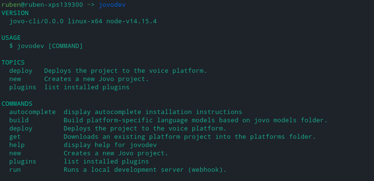

# Jovo CLI

> To view this page on the Jovo website, visit https://www.jovo.tech/marketplace/jovo-cli

The Jovo CLI (GitHub Repository: [jovotech/jovo-cli](https://github.com/jovotech/jovo-cli)) is the center of voice app development with the Jovo Framework. With it, you can quickly create new Jovo projects, create language models and deploy them to the voice platforms, and run your voice apps locally for easy prototyping and testing.

:exclamation: If you don't have access to the [repository](https://github.com/rubenaeg/filebuilder), please contact ruben@jovo.tech. :exclamation:

- [Development Setup](#development-setup)
  - [Install the Jovo Filebuilder](äinstall-the-jovo-filebuilder)
  - [Download the template for `jovo new`](#download-the-template-for-jovo-new)
  - [Install the Jovo CLI](#install-the-jovo-cli)

## Development Setup

To configure the Jovo CLI for development, you'll need to complete a few steps before actually installing the CLI itself.

### Install the Jovo Filebuilder

Since the Jovo Filebuilder is not yet registered on NPM, you have to install and link it by yourself.

```sh
# Clone the Jovo Filebuilder.
$ git clone git@github.com:rubenaeg/filebuilder.git

# Switch directories.
$ cd filebuilder/

# Run the NPM script devSetup, which will install dependencies, compile TypeScript and link the package, so it is available globally on your machine.
$ npm run devSetup
```

### Download the template for `jovo new`

`jovo new` currently uses a template folder to create new projects from. If you run `jovo new`, it's important that your working directory is the parent directory of the template repo, otherwise the CLI won't find the folder, resulting in an error.

```sh
# Clone the template. It's important to clone this repo into template/!
$ git clone git@github.com:rubenaeg/jovo-template-dev.git template
```

### Install the Jovo CLI

Now that you completed all prerequisites, you can go on and install the Jovo CLI.

```sh
# Clone the CLI repository.
$ git clone git@github.com:rubenaeg/jovo-cli.git

# Switch directories.
$ cd jovo-cli/

# Run the NPM script devSetup, which will install dependencies, compile TypeScript and link all necessary packages.
$ npm run devSetup
```

## Usage

Once you installed everything, run `jovodev` to confirm everything is working. The output should look similar to this:



If you want help with any command, just type `jovodev {COMMAND} --help`.
